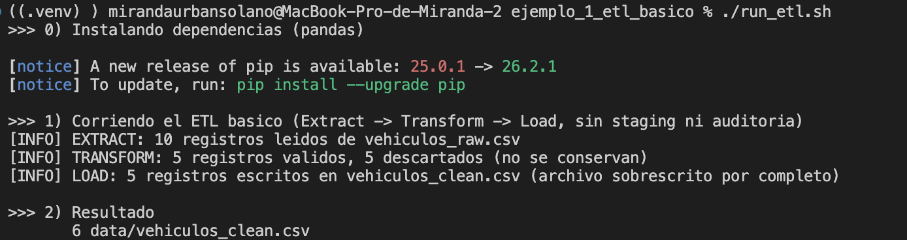
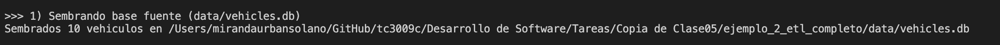
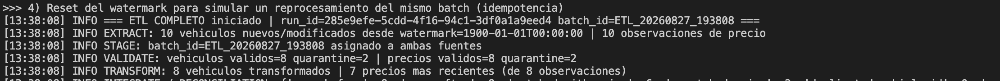
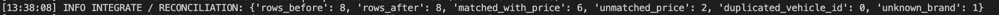
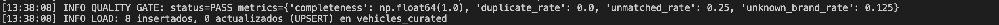
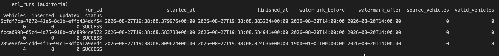
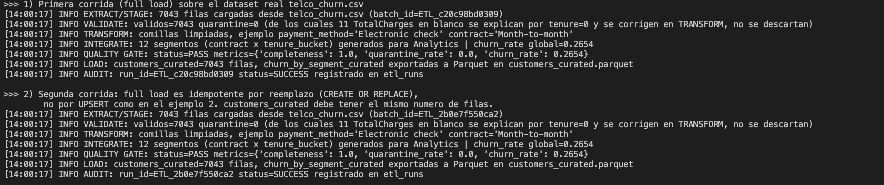

# Análisis archivos

## Parte 1

Evidencia del primer log obtenido al correr el programa



**Preguntas relacionadas:**

- ¿Dónde queda evidencia de los registros que `transform()` descarta?

La variable `rejected = (~valid).sum()`almacena aquellos registros que no se consideran válidos y que por ende, se descartan. En este caso fueron 5 elementos.

- ¿Cómo sabrías, sin volver a correr el script, cuántos registros tenía el archivo original en la última ejecución?

Para saber la cantidad original de registros, la función de `extract()`mide el length del dataset y lo regresa como resultado.

- ¿Qué pasaría si este script corriera todos los días y el archivo de entrada creciera cada vez más?

Si el archivo se corriera todos los días, `to_csv()` sobrescribiría completamente el archivo que exista en `path`.Por ello, si el archivo de entrada creciera, el script sobrescribiría el archivo de salida con todos los registros acumulados hasta ese momento.

## Parte 2

### Checkpoint A — DEFINE

- **Grain**: ¿qué representa una fila en `vehicles_curated`?

Representa toda la información de un vehículo, con toda u información más reciente consolidada).

- **Business key**: ¿qué campo identifica un vehículo de forma lógica?

El campo que identifica a cada vehículo es **`vehicle_id`**.

- **Refresh strategy**: ¿full o incremental?

Se debe usar incremental, utilizando \*\*`updated_at` para identificar qué registros nuevos o modificados deben procesarse y con ello lograr tener un mejor control y trazabilidad.

- **Data contract** mínimo para `vehicles`:

Para `vehicles`:

- `vehicle_id`: Integer, requerido y mayor que 0.
- `year`: Integer, entre 1990 y el año actual.
- `mileage`: Float, mayor o igual a 0.

Para `market_prices`:

- `price`: Decimal, mayor que 0.
- `currency`: Text, debe pertenecer a una lista de monedas permitidas.

* **Failure strategy**

Para procesos como estos, donde es importante auditar y guardar información en caso de errores, la estrategia ideal para manejar registros inválidos es guardarlos en cuarentena, con el fin de poder usarlos en caso de ser necesario.

### Checkpoint B — Datos semilla: de dónde salen y cómo generarlos

Se cumplen con la obtención de los datos a través de diferentes archivos:

```json
{
  "database_path": "data/vehicles.db",
  "market_prices_path": "data/market_prices.csv",
  "manufacturers_path": "data/manufacturers.json",
  "aliases_path": "data/brand_aliases.json",
  "watermark_path": "data/watermark_state.json",
  ...
}
```

### Checkpoint C — EXTRACT + STAGE



### Checkpoint D — VALIDATE



### Checkpoint E — TRANSFORM + INTEGRATE



### Checkpoint F — QUALITY GATE

Se cumplen con los controles de calidad:

```json
{
  "quality_thresholds": {
    "completeness_min": 0.9,
    "duplicate_rate_max": 0.05,
    "unmatched_rate_max": 0.3,
    "unknown_brand_rate_max": 0.2
  }
}
```

### Checkpoint G — LOAD



### Checkpoint H — AUDIT



## Parte 3

### Checkpoint I — DEFINE + EXTRACT/STAGE


### Checkpoint J — VALIDATE (el caso interesante #1)


### Checkpoint L — INTEGRATE con dos grains


### Checkpoint M — QUALITY GATE, LOAD y AUDIT



### Notas

- ¿Qué decidiste como `grain` y `business key` en cada ejemplo, y por qué?

Se utilizo `grain = un cliente`porque si el orden de lectura del CSV cambia, el id cambia, por lo que al no ser estavle, no sirve como key para hacer UPSERT, por ende el refresh puede verse como sea full load. Para el ejemplo 2, se usó un refresh incremental por watermark `updated_at` con `UPSERT` porque se tenía una key estable entre corridas (`customer_id`).

- En el Ejemplo 3, explica con tus palabras por qué el blanco en `TotalCharges` no se trató como un error.

Dado que las 11 filas de `TotalCharges = ' '` implican que clientes con tenure = 0, se puede leer como clientes que han sido recientemenre dados de alta y que todavía no han completado un ciclo de facturación. No tienen cargo total todavía porque aún no existe ese cargo. Es una regla de negocio, por lo que se usa `TRANSFORM` para corrigirlo a 0.0 y poder interpretarlo.

- ¿Qué pasaría si, en el Ejemplo 2, quitaras la validación de cardinalidad en `integrate()`? Descríbelo con un ejemplo numérico.

Sin esa validación, un JOIN (1:1) puede convertirse en 1:muchos si el lado "uno" tiene duplicados en la key.

Ejemplo numérico:

orders: 10,000 filas

customers: hay 3 customer_id duplicados

Esos 3 clientes tienen en total 50 órdenes. Al hacer orders JOIN customers ON customer_id, esas 50 órdenes se duplican, por lo que el resultado termina con más filas que las que debería.

- ¿En qué se diferencia, en tu código, la idempotencia del Ejemplo 2 (incremental + UPSERT) de la del Ejemplo 3 (full load + reemplazo)?

El ejemplo 3 utiliza en cada corrida una reconstrucción de `customers_curated` a partir del CSV completo, así que no importa cuántas veces corra, el resultado es siempre el mismo. En cambio, en el ejemplo 2 se hace a nivel de fila vía UPSERT sobre una business key, por lo que solo se actualiza según la watermark y si la key ya existe.
