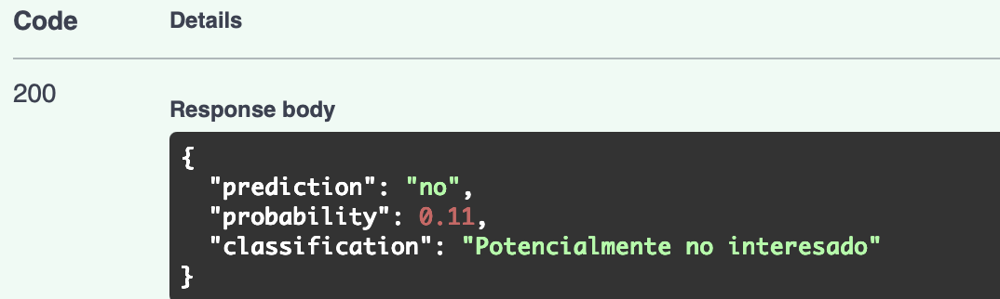
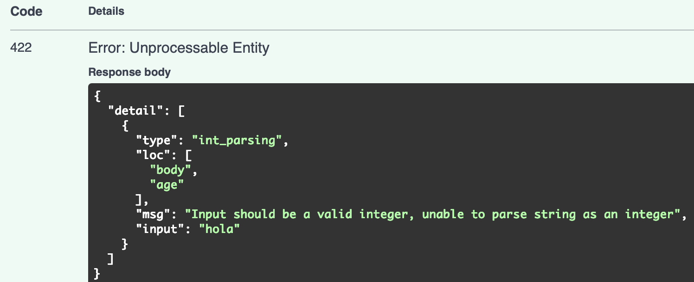
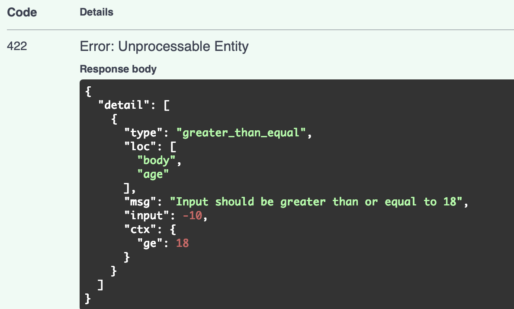
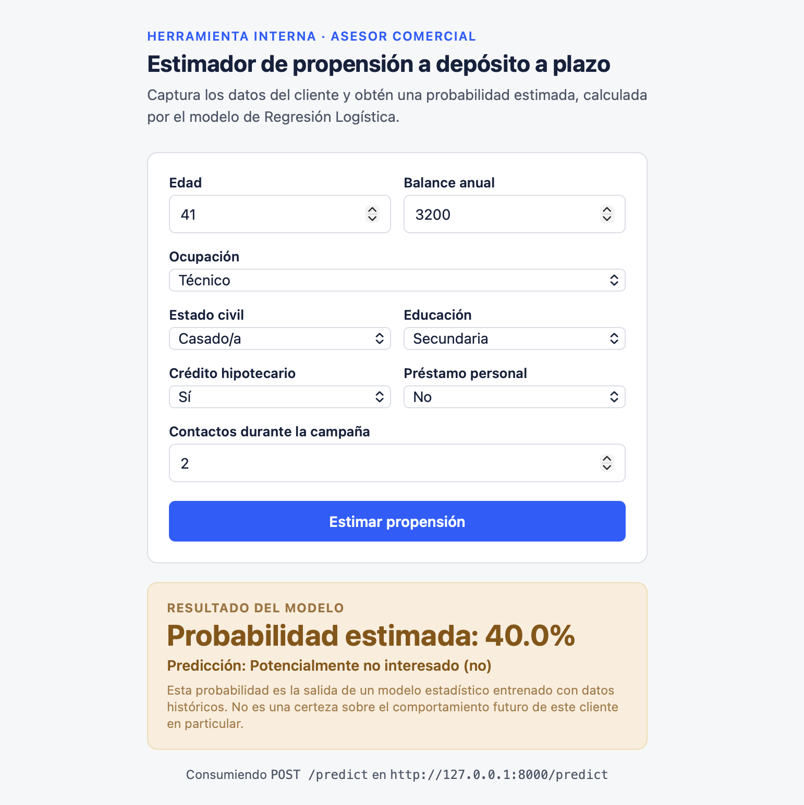

# Bank Marketing Predictor

Sistema de inferencia con Regresión Logística que estima la probabilidad de que un cliente contrate un depósito a plazo, siguiendo el flujo:

```
Datos → Preprocesamiento → Entrenamiento → Persistencia → API → Inferencia → Frontend
```

## Estructura del repositorio

```
bank-marketing-predictor/
├── data/
│   └── bank.csv                       # Dataset Bank Marketing (UCI)
├── training/
│   └── train.py                       # Entrenamiento del modelo
├── models/
│   └── bank_marketing_pipeline.joblib # Pipeline entrenado listo para ser consumido por el API
├── app/
│   ├── main.py                        # API FastAPI
│   ├── schemas.py                     # Validación de request/response
├── frontend/
│   └── index.html                     # Frontend
├── requirements.txt
└── README.md
```

## Dataset

**Bank Marketing** — UCI Machine Learning Repository. Contiene registros de campañas de marketing directo realizadas por una institución bancaria portuguesa. Véase en `data/bank.csv`.

Variables utilizadas por el modelo:

| Variable    | Tipo       | Descripción                              |
| ----------- | ---------- | ---------------------------------------- |
| `age`       | numérica   | Edad del cliente                         |
| `job`       | categórica | Ocupación                                |
| `marital`   | categórica | Estado civil                             |
| `education` | categórica | Nivel educativo                          |
| `balance`   | numérica   | Balance anual promedio                   |
| `housing`   | categórica | Crédito hipotecario (sí/no)              |
| `loan`      | categórica | Préstamo personal (sí/no)                |
| `campaign`  | numérica   | Número de contactos en la campaña actual |

`duration` se excluye debido a que solo se conoce esta variable después de realizar el contacto, por lo que no corresponde a este análisis.
Variable objetivo: `y` (`yes` / `no`).

## Instrucciones de ejecución

### 1. Instalar dependencias

```bash
pip install -r requirements.txt
```

### 2. Entrenar el modelo

```bash
python training/train.py
```

Entrena el pipeline y lo guarda en `models/bank_marketing_pipeline.joblib`. Solo se corre una vez (o cuando se necesite re-entrenar el modelo).

### 3. Levantar la API en dev

```bash
fastapi dev main.py
```

Pruebas con el endpoint en `http://127.0.0.1:8000/docs`.

### 4. Abrir el frontend

Abre `frontend/index.html` directamente en el navegador. El frontend apunta a `http://127.0.0.1:8000/predict` por defecto.

## Resultados del entrenamiento

```
Dataset: 45,211 filas · 17 columnas (8 usadas como predictoras)

Accuracy:  0.6110
Precision: 0.1612
Recall:    0.5673
F1-score:  0.2511
```

### Interpretación

Originalmente, se realizó un análisis sin contemplar que los datos estaban desbalanceados
(la cantidad de "no" es bastante mayor a la cantidad de "yes) en la variable de decisión
de cliente, por lo que las métricas de evaluación arrojaban 0 y únicamente el accuracy
presentaba un valor, de 88% aproximadamente. Al revisar el reporte de clasificación, es
claro que hay un error, pues el modelo presenta un precisión alta, de 89%, al predecir
"no", pero de 0% al predecir "yes"; lo que revela un modelo de poca utilidad.

Con el fin de resolver este problema, se utilizó el parámetro de "class_weight='balanced'"
durante el pipeline de Regresión Logística, ya que este permite equilibrar a la clase
minoritaria penalizando a la clase mayoritaria durante el entrenamiento sin la necesidad
de añadir más casos de "yes" para balancear el dataset. Con ello se logró modificar las
métricas obtenidas, obteniendo los siguientes resultados:

- **Accuracy**: El accuracy disminuyó a 61%, lo que indica que el modelo clasifica correctamente aproximadamente 6 de cada 10 clientes. Este resultado puede considerarse bajo, por lo que se puede afirmar que el modelo tiene un desempeño general limitado y no debería utilizarse como único criterio para tomar decisiones.

- **Precision (clase "yes")**: De los clientes que el modelo clasifica como "yes", únicamente el 16% realmente contrata el depósito. Esto permite ver que existen múltiples falsos positivos, en otras palabras, el modelo logra identificar lgunos clientes potencialmente interesados, pero la predicción no es exacta, por lo que no hay oca certeza de que el cliente realmente vaya a contratar el producto.

- **Precision (clase "no")**: De los clientes que el modelo marca como "no", el 92% efectivamente no contrata el depósito. Lo que indica que el modelo tiene un buen desempeño al identificar clientes que probablemente no estén interesados. Esto puede ayudar a identificar a los clientes que no entren dentro de este perfil y concentrar los esfuerzos comerciales en ellos, pero no garantiza que un cliente clasificado como "no" necesariamente rechazará el producto.

- **Recall (clase "yes")**: De todos los clientes que sí contratan los depósitos, el modelo identifica correctamente el 57%. Por lo que es posible identificar a poco más de la mitad de los clientes que podrían estar interesados. Esto puede resultar útil, ya que se puede utilizar como herramienta de filtrado para priorizar clientes, pero no es suficientemente preciso como para considerar que todos los clientes no detectados carecen de potencial.

- **F1-score (clase "yes")**: El F1-score es de 25% lo que indica que hay equilibrio deficiente entre precision y recall. Esto podría indicar que el modelo todavía tiene dificultades para identificar de manera confiable a los clientes realmente interesados.

## Evidencia de funcionamiento

### Caso A — Inferencia válida

Solicitud:

```bash
curl -X POST http://127.0.0.1:8000/predict \
  -H "Content-Type: application/json" \
  -d '{
    "age": 41,
    "job": "technician",
    "marital": "married",
    "education": "secondary",
    "balance": 3200,
    "housing": "yes",
    "loan": "no",
    "campaign": 2
  }'
```

Respuesta:

```json
{
  "prediction": "no",
  "probability": 0.4,
  "classification": "Potencialmente no interesado"
}
```



### Caso B — Inferencia con error

**Tipo incorrecto** (`age: "hola"`) → `HTTP 422`:

```json
{
  "detail": [
    {
      "type": "int_parsing",
      "loc": ["body", "age"],
      "msg": "Input should be a valid integer, unable to parse string as an integer",
      "input": "hola"
    }
  ]
}
```



**Valor fuera de rango** (`age: -10`) → `HTTP 422`:

```json
{
  "detail": [
    {
      "type": "greater_than_equal",
      "loc": ["body", "age"],
      "msg": "Input should be greater than or equal to 18",
      "input": -10,
      "ctx": {
        "ge": 18
      }
    }
  ]
}
```



En ambos casos la validación ocurre **antes** de que el código del
endpoint se ejecute (Pydantic la rechaza automáticamente), por lo que el
modelo nunca recibe datos inválidos.

### Caso C — Frontend

El frontend captura únicamente las 8 variables usadas por el modelo.

- Al presionar **"Estimar propensión"**, arma un JSON y hace `fetch(API_URL, { method: "POST", ... })` contra `/predict`.
- Muestra la respuesta real de la API (`probability`, `prediction`, `classification`).
- Si la API responde con un error (422/500), se muestra el mensaje de `detail` devuelto por FastAPI en lugar de un resultado.



## Preguntas

**¿Por qué el modelo se entrena fuera de la API y no dentro de /predict?**

Lo correcto es entrenar el modelo de manera independiente porque es un proceso que lleva tiempo. En el caso de este trabajo no es tan fácil de percibir, pero con datasets más grandes o complejos esto puede llevar días. Además, el hacer una solicitud al API se espera que sea rápida, no más allá de algunos milisegundos. Por lo que, la combinación de estos dos factores, nos indica que el modelo debe de entrenarse fuera del endpoint, de lo contrario cada solicitud sería lenta y correría el riego de que se entrene con una partición de datos distinto, lo que lo haría inconsistente entre clientes.

**¿Por qué es importante utilizar durante inferencia exactamente el mismo preprocesamiento utilizado durante entrenamiento?**

Es importante utilizar el mismo procesamiento porque, al utilizar funciones como `StandardScaler` y `OneHotEncoder`, se generan elementos (media, desviación estándar, columnas) que no siempre van a coinicidir si se usa un procedimiento diferente. Por lo que, si se usara un preprocesamiento diferentelas predicciones serían incorrectas o el sistema fallaría directamente porque sus características pueden llegar a ser diferentes. Por ejemplo, en el caso de este ejercicio, se utiliza `ColumnTransformer` dentro del pipeline porque coinicide tanto para el modelo como para la inferencia, lo que permite que el ntrenamiento y la inferencia utilicen el mismo objeto de preprocesamiento.

**¿Qué diferencia existe entre predict() y predict_proba() en este problema?**

La diferencia recae en que `predict()` se utiliza con el fin de definir la matriz de datos que se utiliza para las predicciones,
por ejemplo, devuelve directamente la clase asignada ("0" o "1" para "yes" o "no"), aplicando el mismo umbral de probabilidad. En cambio, `predict_proba()` permite obtener las estimaciones devueltas por el modelo para todas las clases, ordenadas por etiquetas de clases, lo que permite diferencias entre cuáles son las probabilidades más altas para cada etiqueta y, de esta forma, poder definir la prioridad que se le da a cada cliente con base en los resultados; resulta más conveniente llamar a los usuarios con un porcentaje mayor en esta etiqueta, pues su grado de propensión indica que se les debe de considerar primero.

**Si el modelo devuelve una probabilidad de 0.72, ¿qué significa ese valor y qué NO significa?**

Ese valor significa que, según los patrones aprendidos de su entrenamiento (los datos históricos dados), aproximadamente el 72% de las veces que apareció un perfil con características similares, el cliente terminó contratando el depósito. Importante entender que no garantiza que ese cliente en específico tenga un 72% de probabilidad "real" de comportarse como el modelo lo predijo, o sea, básicamente es una estimación basada en correlaciones del pasado y sujeta a los límites de estas. Por lo que, a la hora de tomarse una decisón final, se debe de hacer considerando esa información y no tomarlo como un dato duro.

**¿Por qué duration no debería utilizarse en este sistema si queremos hacer la predicción antes de contactar al cliente?**

El análisis busca entender con qué clientes es más probable concretar una venta, por lo que se requiere entender sus perfiles previos a la realización de la llamada, por tanto no debe de considerarse porque no es una variable con la que cuente la persona a cargo de este proceso. Al ser una estimación a futuro, no se cuenta con ese dato y por tanto, no debe de ser considerado para el análisis porque no aporta a la predicción que se solicita.

**¿Qué ocurriría si mañana cambia la estructura de los datos enviados por el frontend?**

Si se cambiara la estructura (se agrega, renombra o cambia el tipo de variable) el archivo de `schemas.py` lo rechazaría con un error 422 porque no estaría previamente declarado; sin embargo, no rompería la aplicación por las implementaciones preventivas que se tienen. Por lo que si se quisiera realizar un cambio sería necesario actualizar `schemas.py` y re-entrenar el modelo de `train.py` para que el cambio de estructura coincida con el modelo y las validaciones de este. La razón detrás de esto es la separación que se realizó, ya que como parte de los beneficios que aporta esta que contiene el impacto de un cambio en los datos, evitando que se propaguen errores hasta obtener un modelo deficiente.
