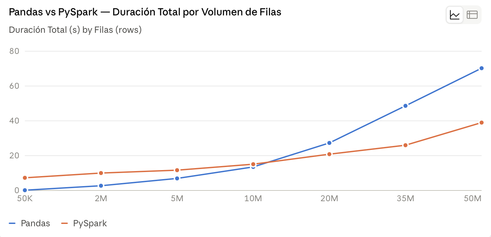
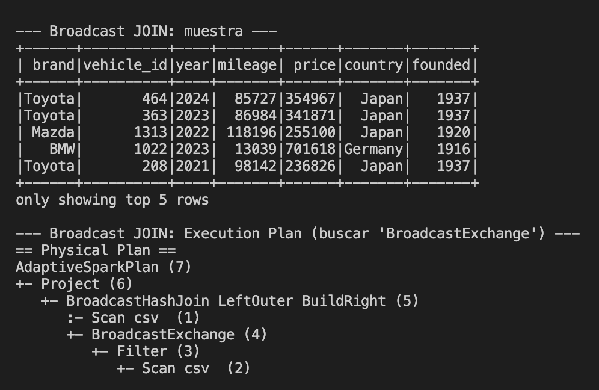
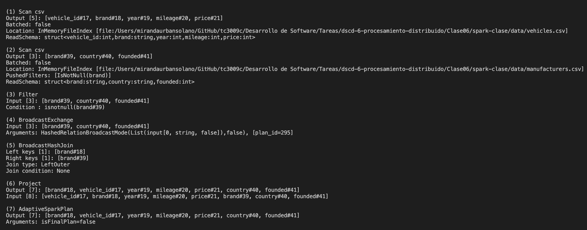
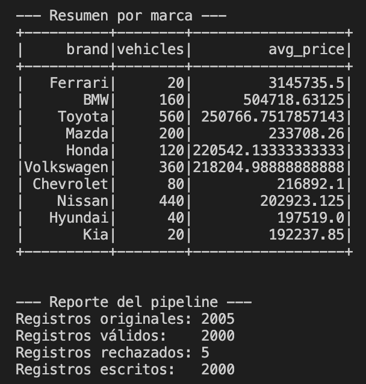
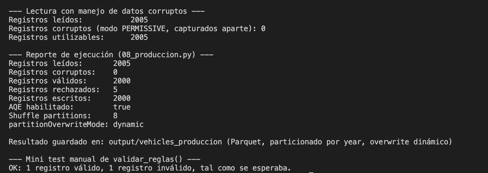
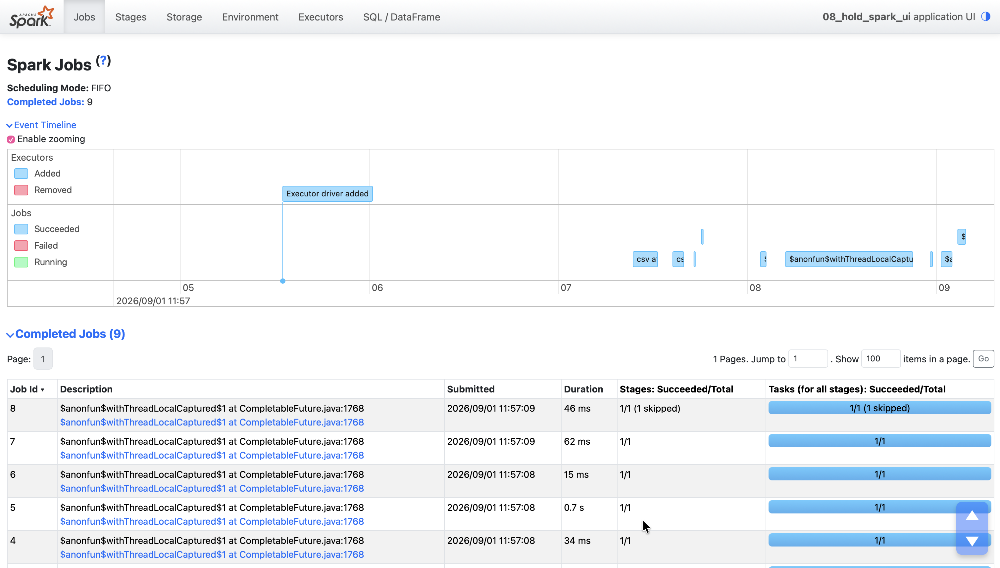

# Resultados de la práctica

## Preguntas de Análisis

- Explique las razones técnicas por las cuales Pandas es más rápido que PySpark en volúmenes pequeños (50K - 500K filas), considerando el overhead de inicialización de la JVM, SparkContext y Catalyst Optimizer.

Pandas es una biblioteca de Python que está construida sobre NumPy para la manipulación y el análisis de datos. Esto implica que ejecuta las operaciones directamente en memoria dentro del mismo proceso Python. Lo que lo hace permite un procesamiento eficiente en memoria, una sintaxis directa y una curva de aprendizaje baja. Sin embargo, impone una limitante muy importante: solo es adecuado para conjuntos de datos pequeños que caben en la memoria y requieren una manipulación rápida de datos en la memoria (Meyer, 2025).

Por otro lado, Spark se ejecuta en la Máquina Virtual Java (JVM), que administra la memoria, maneja la recolección de basura y proporciona un entorno de tiempo de ejecución para las aplicaciones de Spark. Esto implica que tenga la capacidad de abstraer la complejidad de la computación distribuida, lo que permite la distribución de tareas y la tolerancia a fallas al dividir grandes conjuntos de datos en particiones para distribuirlos a través de múltiples nodos en un clúster. Cada nodo procesa su parte de los datos de forma independiente, y los resultados se agregan para producir el resultado final. Esto tiene como conseciencia una sobrecarga de la gestión de la informática distribuida de la mano de un funcionamiento más lento que Scala o Java para ciertas operaciones, ya que el código Python debe traducirse a instrucciones de JVM (Meyer, 2025).

Con esto en mente, Pandas evita el overhead fijo de arrancar JVM, además de otros procesos para el uso de Spark. Consideraciones que Spark si tiene y con las que debe de cargar en términos de costo, sin importar el tamaño del dataset. Con volúmenes chicos, ese overhead supera por mucho el tiempo real de cómputo, así que Pandas gana en esos contextos.

- Identifique el rango de filas y tamaño en MB donde se presentó el Punto de Inflexión (Crossover Point) en su entorno de ejecución.

El punto de inflexión se ubica aproximadamente a las 10,000,005 filas, después de este punto, se muestra una mejora evidente del tiempo con el uso de Spark (véase la gráfica de identificación del Crossover Point para más detalle). Esto indica que el cambio ocurre en algún punto entre ~320 MB y ~650 MB, donde el tiempo de procesamiento empieza a superar el overhead de Spark y el paralelismo comienza a ser funcional.

- Compare el comportamiento del consumo pico de memoria RAM de Pandas contra el de PySpark a medida que incrementó el volumen de datos.

Pandas escala memoria de forma proporcional y sin techo de contención, se usa hasta que la maquina lo permite. Mientras que Spark mantiene un consumo por executor mejor gestionado, a costa de mayor complejidad interna y (en volúmenes chicos) peor rendimiento.

- Describa las ventajas de almacenar el resultado final en formato Parquet particionado en comparación con un archivo CSV único.

Almacenar en formato Parquet permite guardar los datos por columna, no por fila. Por lo que se pueden leer solo las columnas necesarias para una consulta, sin necesidad de leer la fila completa si es que no se requiere. Además, incluye metadatos y un schema embebid que permite eficientar las consultas, sin comprometer el tamaño debido a sus técnicas de optimización de espacio. En CSV no se cuenta con estos beneficios, por lo que este formato no ofrece un buen rendimiento de consultas, manejo de datos e integración de infraestructuras (Badman & Kosinski, 2025).

## Tabla de comparación de la ejecución de los 7 experimentos del benchmark

| Exp   | Modo / Motor          | Filas (rows) | Tamaño CSV | Hora Inicio         | Hora Fin            | Duración Total (s) | Memoria Pico (MB) | Uso CPU Est. (%)     | Ganador / Estado                     |
| ----- | --------------------- | ------------ | ---------- | ------------------- | ------------------- | ------------------ | ----------------- | -------------------- | ------------------------------------ |
| Exp 1 | Pandas (Tradicional)  | 50,005       | 1.5 MB     | 2026-09-01 11:41:07 | 2026-09-01 11:41:08 | 0.15               | 10.6              | Monohilo (~100%)     | Pandas gana                          |
|       | PySpark (Distribuido) |              |            | 2026-09-01 11:41:08 | 2026-09-01 11:41:16 | 7.28               | -                 | Multihilo (Overhead) |                                      |
| Exp 2 | Pandas (Tradicional)  | 2,000,005    | 63.3 MB    | 2026-09-01 11:41:29 | 2026-09-01 11:41:32 | 2.72               | 413.1             | Monohilo (~100%)     | Pandas gana                          |
|       | PySpark (Distribuido) |              |            | 2026-09-01 11:41:32 | 2026-09-01 11:41:43 | 10.01              | -                 | Multihilo (Parcial)  |                                      |
| Exp 3 | Pandas (Tradicional)  | 5,000,005    | 159.8 MB   | 2026-09-01 11:42:18 | 2026-09-01 11:42:26 | 6.92               | 1032.3            | Monohilo (~100%)     | Pandas gana (brecha se reduce)       |
|       | PySpark (Distribuido) |              |            | 2026-09-01 11:42:26 | 2026-09-01 11:42:38 | 11.66              | -                 | Multihilo (Parcial)  |                                      |
| Exp 4 | Pandas (Tradicional)  | 10,000,005   | 320.6 MB   | 2026-09-01 11:43:05 | 2026-09-01 11:43:19 | 13.52              | 2064.4            | Monohilo (~100%)     | Punto de Inflexión (casi empate)     |
|       | PySpark (Distribuido) |              |            | 2026-09-01 11:43:19 | 2026-09-01 11:43:35 | 15.09              | -                 | Multihilo (Cálculo)  |                                      |
| Exp 5 | Pandas (Tradicional)  | 20,000,005   | 651.7 MB   | 2026-09-01 11:44:12 | 2026-09-01 11:44:40 | 27.31              | 4128.5            | Monohilo (~100%)     | Spark (Victoria 1 - Multihilo)       |
|       | PySpark (Distribuido) |              |            | 2026-09-01 11:44:40 | 2026-09-01 11:45:01 | 20.85              | -                 | Multihilo (>300%)    |                                      |
| Exp 6 | Pandas (Tradicional)  | 35,000,005   | 1148.5 MB  | 2026-09-01 11:45:51 | 2026-09-01 11:46:40 | 48.63              | 7224.7            | Monohilo (~100%)     | Spark (Victoria 2 - Escalamiento)    |
|       | PySpark (Distribuido) |              |            | 2026-09-01 11:46:40 | 2026-09-01 11:47:06 | N/D\*              | -                 | Multihilo (>400%)    |                                      |
| Exp 7 | Pandas (Tradicional)  | 50,000,005   | 1645.2 MB  | 2026-09-01 11:48:07 | 2026-09-01 11:49:17 | 70.24              | 10320.9           | OOM / Saturación     | Spark (Victoria 3 - Resiliencia RAM) |
|       | PySpark (Distribuido) |              |            | 2026-09-01 11:49:17 | 2026-09-01 11:49:56 | N/D\*              | -                 | Spill to Disk        |                                      |

## Gráfica comparativa con identificación del Crossover Point

Como se puede ver en el siguiente gráfico, es posible observar que el rossover Point está dado en los **10M de filas (aproximadamente)**. Previo a este punto, Pandas muestra indicios de mayor rapidez en todos los casos. Al pasar este punto, Spark se vuelve más rápido y la ventaja crece con cada experimento.

## Capturas de evidencia

- Evidencia de scripts iniciales

- Evidencia de pipeline
  

- Evidencia de producción
  

- Spark UI
  

## Análisis de los scripts de producción (07_etl_pipeline.py y 08_produccion.py)

Ambos scripts procesaron el mismo dataset base de 2005 registros originales, con una tasa de rechazo consistente del 0.25% (5 registros): 2000 registros válidos escritos en ambos casos.

El script `07_etl_pipeline.py` genera un resumen por marca con información relevante sobre estos, lo cual puede generar valor de negocio inmediato. Además, muestra los resultados específicos del pipeline (ETL end-to-end) lo que permite tener una trazabilidad clara del procesamiento de los datos, al igual que aporta un indicador clave de la calidad de los datos, útil para comparar con los estándares del negocio.

El script `08_produccion.py`igualmente ofrece una perspectiva de trazabilidad y calidad de datos, pero esta vez de manera más detallada. Muestra información relevante como: manejo de datos corruptos, Adaptive Query Execution (AQE) para ajustar dinámicamente el número de particiones de shuffle según el volumen real de datos, detalles sobre la escritura en formato Parquet, así como una validación de reglas de negocio, lo que permite evaluar antes de confiar en el resultado agregado.

En resumen, ambos scripts permiten garantizar al cliente o usuario que un buen manejo de errores, con particionamiento eficiente y pruebas automatizadas.

## Referencias

- Badman, A., & Kosinski, M. (2025, 27 noviembre). Apache Parquet. Think. https://www.ibm.com/mx-es/think/topics/parquet
- Meyer, L. (2025, 27 enero). pandas vs. PySpark. Blog Le Wagon. https://blog.lewagon.com/skills/pandas-vs-pyspark/#elementor-toc__heading-anchor-3

### Uso IA

Se utilizó IA

- Herramienta: Claude
- Uso realizado: Se utilizó para la generación de la gráfica de comparación
- Secciones donde se utilizó: Sección de gráfica comparativa
- Validación realizada por el estudiante: Se hizo uso de los datos obtenidos y se comparó que estuvieran correctamente representados.
  Confirmo que revisé, verifiqué y asumo la responsabilidad del contenido final entregado.
